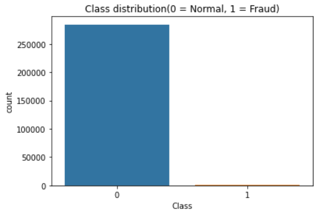
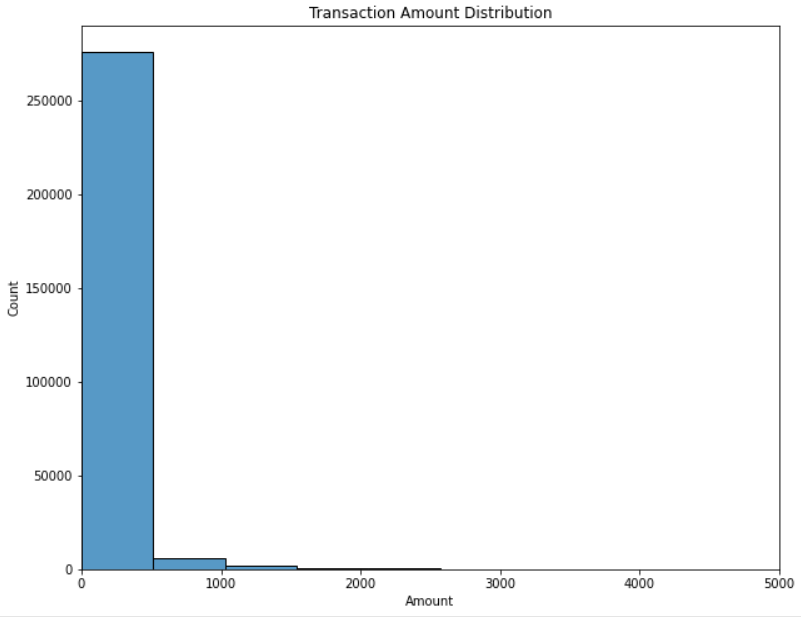
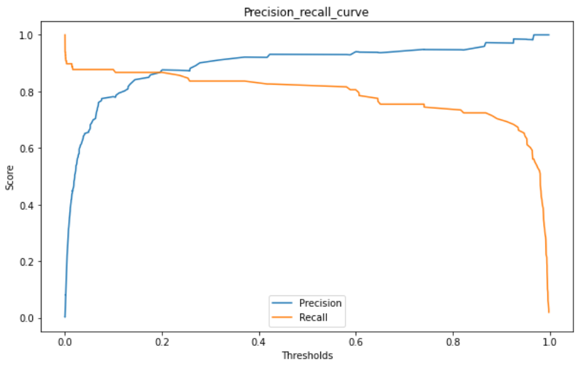
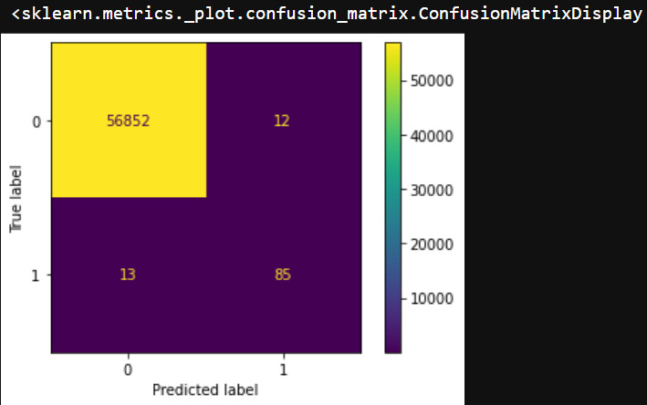
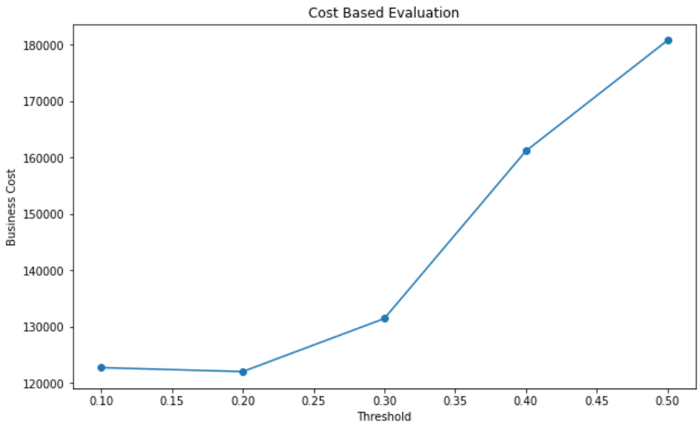
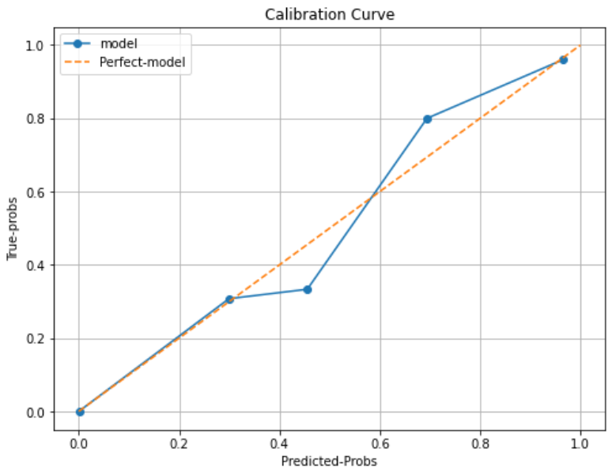
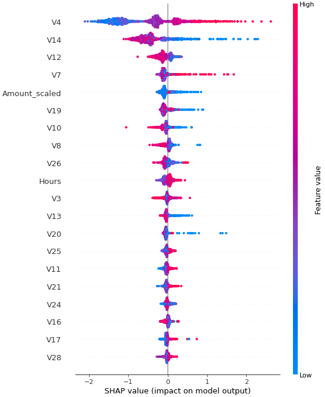
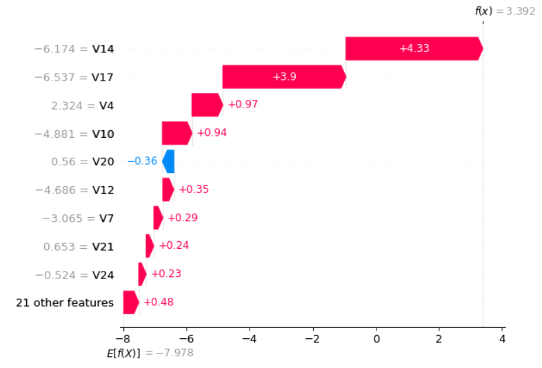

# Credit Card Fraud Detection System 

## 📌 Project Overview

This project is an end-to-end machine learning system designed to detect fraudulent credit card transactions.

The goal is not just to maximize model accuracy, but to build a production-oriented fraud detection pipeline that minimizes business loss while maintaining high fraud detection performance.

The project covers the complete machine learning lifecycle:
- Data exploration and preprocessing
- Handling extreme class imbalance
- Advanced model training using XGBoost
- Threshold tuning
- Probability calibration
- Cost-based optimization
- Model explainability using SHAP
- Anomaly detection experimentation
- Model monitoring
- Deployment-ready project structure

This project simulates how fraud detection systems are developed in banks, fintech companies, and payment platforms.

---

## 🏢 Business Problem

Credit card fraud is a high-impact business problem.

Fraudulent transactions are extremely rare (less than 0.2% of all transactions), but each missed fraud can lead to significant financial losses.

### Main Challenges

1. **Extreme Class Imbalance**  
   Fraud cases are very rare compared to legitimate transactions.

2. **Cost Asymmetry**  
   Missing a fraud (False Negative) is far more expensive than flagging a legitimate transaction (False Positive).

3. **Unreliable Probabilities**  
   Raw model probabilities may not reflect true risk.

4. **Need for Explainability**  
   Financial institutions must justify why a transaction was flagged.

5. **Concept Drift**  
   Fraud patterns change over time.

### Objective

Build a fraud detection system that:
- Detects as many frauds as possible
- Minimizes false alerts
- Reduces overall business loss
- Provides interpretable predictions
- Is ready for deployment

---

## 📊 Dataset

Dataset used: Kaggle Credit Card Fraud Detection Dataset

### Dataset Characteristics
- 284,807 transactions
- 492 fraud transactions
- Fraud ratio: 0.172%
- 30 input features

### Features
- `Time`: Seconds elapsed since the first transaction
- `Amount`: Transaction amount
- `V1` to `V28`: PCA-transformed anonymized features
- `Class`: Target variable (`1 = Fraud`, `0 = Normal`)

### Why PCA Features?

The original transaction features were transformed using Principal Component Analysis (PCA) to protect sensitive customer and financial information.

### Why This Dataset Is Ideal

This dataset is widely used because it represents a realistic and highly imbalanced fraud detection scenario.

---

## ⚠️ Key Challenges Faced During the Project

### 1. Extreme Class Imbalance

Only 492 out of 284,807 transactions are fraudulent.

If a model predicts every transaction as legitimate, it still achieves over 99.8% accuracy.

**Solution:** Used `scale_pos_weight`, threshold tuning, and cost-based evaluation.

---

### 2. Accuracy Was Misleading

Traditional accuracy was not useful because the minority class was extremely small.

**Solution:** Focused on Precision, Recall, ROC-AUC, Precision-Recall Curve, and Business Cost.

---

### 3. Balancing Precision and Recall

Increasing recall often caused many false positives.

**Solution:** Tuned the decision threshold to find the best trade-off.

---

### 4. Uncalibrated Probabilities

Raw XGBoost probabilities were under-confident.

**Solution:** Applied Isotonic Calibration.

---

### 5. Business Cost Optimization

The best ROC-AUC score did not necessarily produce the lowest business loss.

**Solution:** Created a custom cost function and selected the threshold with minimum cost.

---

### 6. Explainability Requirement

Financial systems require auditability and interpretability.

**Solution:** Used SHAP summary plots and waterfall plots.

---

### 7. Evaluating Advanced Techniques

Isolation Forest improved ROC-AUC but increased false positives.

**Solution:** Compared methods using business cost and rejected the hybrid model.

---

### 8. Production Readiness

A notebook alone is not sufficient for deployment.

**Solution:** Modularized preprocessing, prediction, and monitoring logic and saved model artifacts.

---

## 🏗️ Project Pipeline

1. Data Loading
2. Exploratory Data Analysis
3. Feature Engineering
4. Train-Test Split (Stratified)
5. Handling Imbalanced Data
6. XGBoost Training
7. Threshold Tuning
8. Precision-Recall Analysis
9. Probability Calibration
10. Cost-Based Evaluation
11. SHAP Explainability
12. Isolation Forest Experiment
13. Monitoring Logic
14. Deployment Preparation

---

## 🤖 Model Development

### Baseline Model
- XGBoost Classifier

### Imbalance Handling
- `scale_pos_weight`

### Probability Calibration
- Isotonic Regression

### Threshold Optimization
- Selected threshold based on business cost minimization

### Explainability
- SHAP Summary Plot
- SHAP Waterfall Plot

### Advanced Experiment
- Isolation Forest + XGBoost Hybrid

---

## 📈 Final Production Results

| Metric | Value |
|------|------:|
| Precision | ~0.81 |
| Recall | ~0.88 |
| ROC-AUC | ~0.98 |
| Optimal Threshold | 0.20 |
| Minimum Business Cost | ₹1,22,000 |
| False Positives | 20 |
| False Negatives | 12 |

---

## 💰 Business Cost Function

Assumptions:
- False Positive Cost = ₹100
- False Negative Cost = ₹10,000

### Cost Formula

Total Cost = (FP × 100) + (FN × 10,000)

The threshold of 0.20 produced the lowest business cost.

---

## 🧠 Why This Is an Industry-Level Project

This project goes far beyond basic model training.


### This Project Includes
- Severe class imbalance handling
- Threshold optimization
- Probability calibration
- Cost-based decision making
- SHAP explainability
- Anomaly detection experimentation
- Monitoring logic
- Deployment-ready architecture
- GitHub documentation
- Resume and interview preparation

### Industry Skills Demonstrated
- Machine Learning
- Feature Engineering
- Business Metric Design
- Model Calibration
- Explainable AI
- Production Engineering
- Monitoring
- Decision-Making Based on Cost

This is very similar to the workflow used in banks and fintech companies.

---

## 📊 Visualizations Included

- Class Distribution
- Transaction Amount Distribution
- Correlation Heatmap
- Precision-Recall Curve
- Threshold vs Precision/Recall
- Cost vs Threshold
- Calibration Curve
- SHAP Summary Plot
- SHAP Waterfall Plot
- Anomaly Score Distribution

---

## 📊 Exploratory Data Analysis

### Class Distribution


### Transaction Amount Distribution


---

## 📈 Model Performance

### Precision-Recall Curve


### Confusion Matrix


### Cost-Based Evaluation


### Calibration Curve


---

## 🧠 Model Explainability

### SHAP Summary Plot


### SHAP Waterfall Plot


```

## 🛠️ Tech Stack

### Programming Language
- Python

### Data Manipulation
- Pandas
- NumPy

### Data Visualization
- Matplotlib
- Seaborn

### Machine Learning
- Scikit-learn
- XGBoost
- Imbalanced-learn

### Explainable AI
- SHAP
- LIME

### Model Persistence
- Joblib

### Development Environment
- Jupyter Notebook

### Version Control
- Git
- GitHub

---

## 🏁 Conclusion

This project demonstrates the complete lifecycle of building a production-oriented machine learning system for fraud detection.

Starting from raw transaction data, the pipeline addressed extreme class imbalance, trained an XGBoost model, optimized the decision threshold, calibrated probabilities, minimized business cost, and explained predictions using SHAP.

Several advanced techniques were evaluated, including SMOTE, class weighting, Isolation Forest, and probability calibration. Instead of selecting the model with the highest accuracy or ROC-AUC alone, the final model was chosen based on business impact and total financial cost.

### Final Production Model
- XGBoost with `scale_pos_weight`
- Isotonic Probability Calibration
- Optimal Threshold = 0.20
- Cost-Based Optimization
- SHAP Explainability

### Final Results
- Precision: ~0.81
- Recall: ~0.88
- ROC-AUC: ~0.98
- Minimum Business Cost: ₹1,22,000

This project reflects real-world practices used in banks and fintech companies, including business-driven optimization, explainable AI, monitoring, and deployment-ready code organization.

It is an industry-level, portfolio-ready project that demonstrates both advanced machine learning knowledge and practical software engineering skills.
